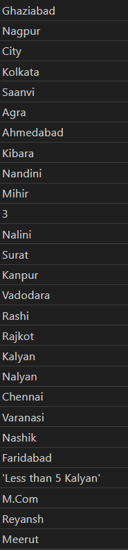
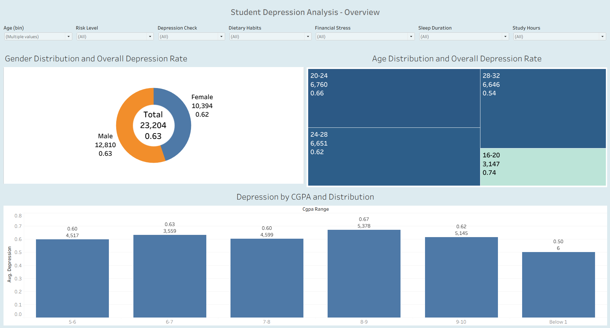
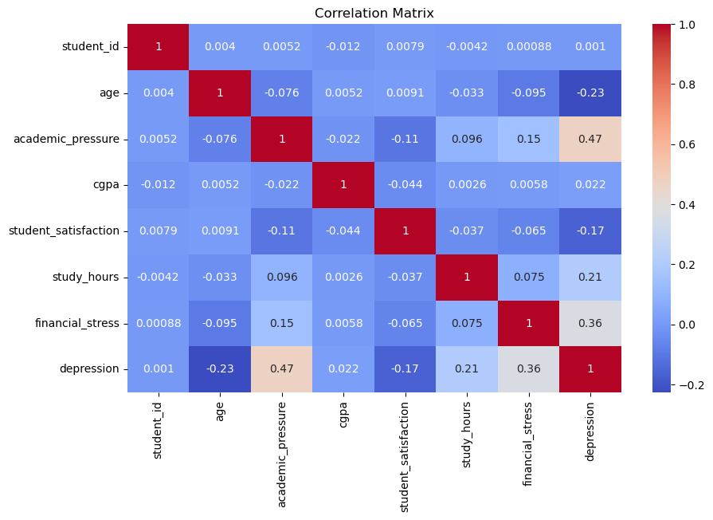

# Analysis of Depression and Risk Factors in Students

## Executive Summary 

This project analyzes factors associated with depression among student using a dataset of over 27000 observations. The objective was to explore how variables such as academic pressure, lifestyle habits, financial stress and psychological factors relate to depression outcomes and to build a composite risk score that helps identify students with a high likelihood of depression.

The analysis combines tools such as Excel, SQL, python and Tableau for data cleaning, analysis and visualization. Results indicate strong relationships between depression and variables such as academic pressure, financial stress, sleep duration, dietary habits and other psychological factors. Students with high composite risk scores show more than double the presence of depression than those with low risk and the former are present in ~30% of the dataset population.

Relevant links:

- [Kaggle Dataset](https://www.kaggle.com/datasets/adilshamim8/student-depression-dataset/data)

- [SQL Queries](data_cleaning.sql)

- [Jupyter Notebook](data_analysis.ipynb)

- [Dashboard](https://public.tableau.com/app/profile/juan.pablo.alvarez5922/viz/StudentDepressionAnalysis_17733491205650/Overview)


## Analytical Questions

The project aims to answer the following questions:

1. How prevalent is depression among students in the dataset?
2. Does depression vary across demographic characteristics such as gender or age group?
3. What academic factors are associated with higher depression levels?
4. Do lifestyle habits correlate with depression outcomes?
5. What role do psychological indicators such as suicidal thoughts or family mental health history play?
6. Can a combined risk score be constructed to help us identify which students are at a higher risk of depression?

## Dataset overview
The dataset is composed of 27901 rows of data with 18 columns with the following structure:

| No | Field | Type | Description |
| -- | -- | -- | -- |
| 1 | student_id | Integer | Unique identifier assigned to each student |
| 2 | gender | String | Gender of the student (Male/Female) |
| 3 | age | Integer | Age of the student |
| 4 | city | String | City or region where the student resides |
| 5 | profession | String | Field of work or study of the student |
| 6 | academic_pressure | Integer | Measure indicating the level of pressure the student faces in academic settings |
| 7 | work_pressure | Integer | Measure of the pressure related to work or job responsibilities |
| 8 | cgpa | Float | Cumulative grade point average of the student |
| 9 | student_satisfaction | Integer | Indicator of how satisfied the students are with their studies |
| 10 | job_satisfaction | Integer | Measure of how satisfied the students are with their job or work environment |
| 11 | sleep_duration | String | Average number of hours the student sleeps per day |
| 12 | dietary_habits | String | Assessment of the student’s eating patterns and nutritional habits |
| 13 | student_degree | String | Academic degree or program that the student is pursuing |
| 14 | suicidal_thoughts | String | Binary indicator (Yes/No) that reflects whether the student has ever experienced suicidal ideation |
| 15 | study_work_hours | Integer | Average number of hours per day the student dedicates to work or study |
| 16 | financial_stress | Integer | Measure of the stress experienced due to financial concerns |
| 17 | family_mental_history| String | Indicates whether there is a family history of mental illness (Yes/No) |
| 18 | depression | Integer | Target variable that indicates whether the student is experiencing depression (Yes = 1/No = 0) |

## Limitations And Assupmtions
### Limitations
- The dataset is observational and does not imply causal relationships.
- Psychological variables such as suicidal thoughts may be self-reported and subject to bias.
- The variable suicidal thoughts does not specify whether the student experience these thoughts at a daily, weekly, monthly bases or just once in their life.
- There are not socioeconomic or institutional environment factors within the dataset.
- There are not variables within the dataset that express if the student has experience depression before in their life, to what frequency have they experience it or whether they sought help.
- Some variables contain categorical groupings (e.g. sleep_duration or dietary_habits) that limit precision.

### Assumptions
- Inconsistent values in numerical fields were replace with the mean of the whole field.
- The composite risk score assumes equal contribution from each included factor.
- Only students with the 'profession' value of 'student' were kept into consideration. These student represent 99% of the dataset.
- Value in the 'city' field point to locations in the country of India

## Tools Used

The analysis was conducted using the following tools:

- Excel - Initial data exploration and Null values handling
- PostgreSQL - Data storage
- Visual Studio Code - Main workspace for queries and coding
- SQL - secondary data exploration and cleaning
- Python - Data analysis and feature engineering
- Tableau - Interactive dashboard creation and visualization
- GitHub – Project version control and documentation

## Cleaning Process

This process took place with the use of SQL in Visual Studio Code.

Key steps:
- Converted values of '?' in the financial_stress column to the field mean of 3
- Checked for duplicates and null values within all fields, no duplicates nor null values were found
- Created a new table (student_survey_clean) with the following fields:

```sql
CREATE TABLE student_survey_clean AS
SELECT
    student_id,
    gender,
    age,
    academic_pressure,
    cgpa,
    student_satisfaction,
    sleep_duration,
    dietary_habits,
    student_degree,
    suicidal_thoughts,
    study_work_hours as study_hours,
    financial_stress,
    family_mental_history,
    depression
FROM student_depression
WHERE profession = 'Student';
```
- The Field 'city' was not taken into consideration for the new table as it contained a good amount of inconsistent values.



- Fields related to 'work' (e.g., 'work_pressure', 'job_satisfaction') were not taken into consideration 

-Created a new field with ranges for the 'cgpa' field to simplify the analysis and visualization process

```sql
ALTER TABLE student_survey_clean
ADD column cgpa_range TEXT;

UPDATE student_survey_clean
SET cgpa_range =
CASE 
    WHEN cgpa <1 THEN 'Below 1'
    WHEN cgpa BETWEEN 1 AND 2 THEN '1-2'
    WHEN cgpa BETWEEN 2 AND 3 THEN '2-3'
    WHEN cgpa BETWEEN 3 AND 4 THEN '3-4'
    WHEN cgpa BETWEEN 4 AND 5 THEN '4-5'
    WHEN cgpa BETWEEN 5 AND 6 THEN '5-6'
    WHEN cgpa BETWEEN 6 AND 7 THEN '6-7'
    WHEN cgpa BETWEEN 7 AND 8 THEN '7-8'
    WHEN cgpa BETWEEN 8 AND 9 THEN '8-9'
    ELSE '9-10'
END;
```

The result table consists of 27870 rows of data and 15 columns.

## Analysis
the data was analyzed using python with the library of pandas. The new cleaned table was loaded to a jupyter notebook with a SQL to Python connection using the 'sqlalchemy' library. After this, the following main steps took place:

### Exploratory Data Analysis

First, the distributions was gender, age and cgpa range were calculated, visualized and paired with their respective depression rate.



To explore the relationships between the variables, a correlation matrix was designed. 
```python
import seaborn as sns
import matplotlib.pyplot as plt

plt.figure(figsize=(10,6))
sns.heatmap(corr, annot=True, cmap='coolwarm')
plt.title("Correlation Matrix")
plt.show()
```




New fields based on 'suicidal_thoughts' and 'family_mental_history' were created to interpret these fields into numerical values.

```python
df['suicidal_binary'] = df['suicidal_thoughts'].map({'Yes': 1, 'No': 0})
df['family_history_binary'] = df['family_mental_history'].map({'Yes': 1, 'No': 0})
```

Fields related to academic performance, finances, lifestyle and psychological factor also were contrasted with the overall depression rate and visualized.


### Feature Engineering
To identify which students were at risk due to pressure from multiple factors, a new field was created by combining the numerical values of the dimensions previously mentioned. Following this, three new categories were created into another field which helped to segment each students.

```python
df['risk_score'] = (
    df['academic_pressure'] +
    df['financial_stress'] +
    df['study_hours'] +
    df['suicidal_binary'] +
    df['family_history_binary']
)
```

```python
df['risk_level'] = pd.qcut(
    df['risk_score'],
    q=3,
    labels=['Low Risk','Medium Risk','High Risk']
)
```

Calculations were made to count the amount of students in each category as well as finding the overall depression rate per category. Later, these values were visualized.


## Key Findings

**Academic Pressure strongly correlates with depression**

More academic pressure shows a 4 times increase from low (1) academic pressure to very high (5). Almost half (0.43) of the students with no academic pressure (0) seem to be affected by depression

**Study Hours shows a positive correlation with depression**

Depression increases as more study hours as spent per day. Students with 6 ≥ hours are above the overall depression rate with 10 to 12 hours being the most impactful.

**Poor lifestyle habits are positively correlated with depression**

The Overall depression rate increases as students engage in poor dietary habits with more than 70% of students who have unhealthy diets reporting depression. The duration of sleep follows a similar pattern but deviation comes with students who sleep 7 to 8 hours which has a higher depression rate than students who sleep for 5 - 6 hours.

**Psychological negative factors are quite present within the population**

65.22% of the students report having experienced suicidal thoughts at least once in their life. 62.52% report having a mental illness within their family history. These factors may influence the prevalence of depression and the rate in which both of them are found is of concern.

**The composite risk score effectively separates risk groups.**

Students with high risk score are associated with high rates of depression. 88.78% of students within the High risk category suffer from certain degree of depression. 

## Business Recommendations

Based on the insights discovered, several practical actions can be taken that could help address and improve the students mental health.

### Monitor high academic pressure environments
Institutions can implement periodic surveys which help them identify in which aspects and areas the students are experiencing academic pressure and their magnitude. These surveys can be used to help address and mitigate the relevant impact of a high academic pressure environment.

### Promote healthy lifestyle habits
Healthy lifestyle habits and their lack of are factors which influence the academic and personal outcomes of students. Institutions could invest in initiatives which aim to provide proper knowledge in the areas of diet and sleep to both students and their parents/guardians. The following areas can be the focus of these programs: improve sleeping conditions, napping and it's benefits, balanced meals and the relevance hydration within the different financial brackets.


### Implement early intervention for high-risk students
Thanks to the risk score, pattern can be extracted which may help identify which students may be within the high risk level or may be heading towards it. This allows institutions and government initiatives to reach those student in need of help.

## Conclusion

The analysis highlights several factors which are associated with the presence of depression among students, including academic pressure, financial stress, lifestyle habits and psychological factors. The constructed risk score helped, in a simple way, identify different levels of risk and which students fall into each of these tiers, helping identify those students in dire need of help and the pattern they present.
